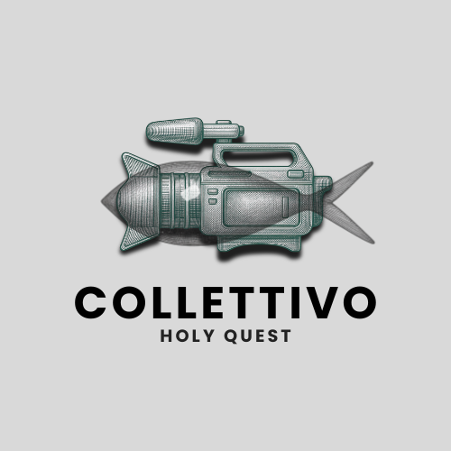

## Ci presentiamo...

::::: columns
::: {.column width="50%"}
Il **collettivo HQ** (Holy Quest) è un gruppo informale nato nella parrocchia Tre Santi di Bolzano e formatosi durante gli incontri di catechismo, qualche pizzata e la frequentazione della messa domenicale. È composto da adolescenti e giovani under 25.

- Il corto *Il trattato di Bolzano*, è il nostro primo cortometraggio a partecipare a un concorso nazionale (marzo 2026).

- Recentemente abbiamo realizzato un secondo cortometraggio *La bella addormentata* (maggio 2026).
:::

::: {.column width="50%"}
{fig-alt="Example figure" fig-align="right" width="314"}
:::
:::::

## I nostri partner

Realizziamo cortometraggi indipendenti e, per il momento, **no-budget**. Questo ci è possibile grazie a due partner indispensabili che ci sostengono in questa avventura:

1.  [**la parrocchia Tre Santi (BZ)**](https://www.tresanti.bz.it/): ci mette a disposizione l'intera chiesa Tre Santi per le riprese;

2.  **l'Azione Cattolica (Diocesi BZ-BR)**: ci consente di noleggiare l'attrezzatura audiovisiva;

## Sostienici

Ci piacerebbe dedicarci a progetti più ambiziosi per coinvolgere la comunità e sensibilizzare su temi importanti.

Vogliamo migliorare la qualità dei nostri cortometraggi, oltre che acquistare nuovo materiale.

::: callout-note
## Se desiderate sostenerci, potete farlo tramite bonifico bancario utilizzando le seguenti coordinate

Intestatario: Parrocchia Tre Santi

<!-- -->

IBAN: IT04 C060 4511 6070 0000 5003 358

Causale: Sostegno per i giovani del collettivo HQ
:::
